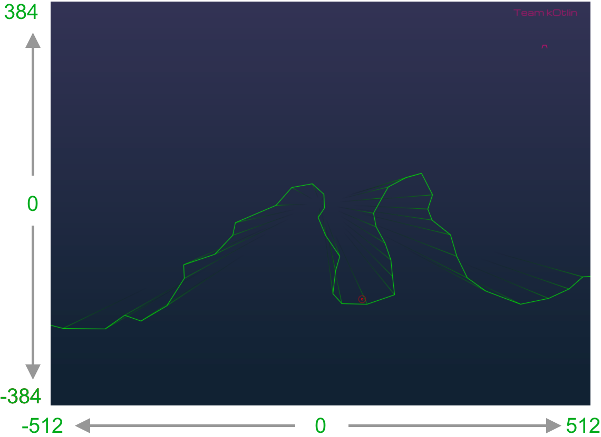
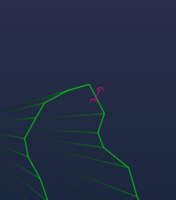

Spacehex-clients
--------
Create an own branch of this repository for your team.
Pick a language from the list below and follow the instructions
in that repository to start a test flight.

#### Specific instructions for each client listed here:
* [Kotlin](spacehex-kotlin-client)
* [Python](spacehex-python-client)
* [C#](spacehex-csharp-client)
* [JavaScript](spacehex-js-client)
* [Go](spacehex-go-client)

### General instructions
The game uses a 2D playing field of size 1024 x 768 Game units.
An example:

### Gravity and mass
Gravity is a force from top to bottom. Your craft conveniently has mass 1.

### Goal
To reach the goal point (the red point), you need to be within 5.0 game units, 
at a speed below 2.5 GU/s.

### Segment collision 
The line segments shown in green should not be crossed. If two subsequent positions
of your craft passes through a line segment, your craft has crashed.

### Max flight time
5 minutes

### Out of bounds
If you go out of the visible area nothing will happen.